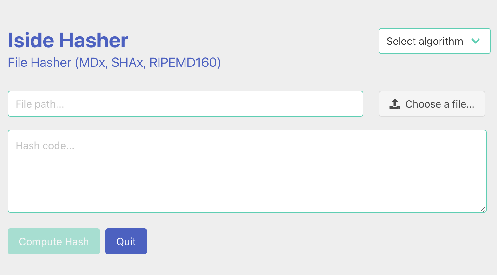

# IsideHasher

The easy file hasher. 

It computes any file's hash code using:

* MD4
* MD5
* RIPEMD160
* SHA-1
* SHA-224
* SHA-256
* SHA-384
* SHA-512

## How to install or setup

You can find release details [here](https://github.com/guildenstern70/IsideHasher/releases)

### Download

Pre-compiled binaries are available [here](https://github.com/guildenstern70/IsideHasher/releases).

To install Linux version, open a terminal, cd into the directory with the snap image and type:

    sudo snap install --dangerous ./iside-hasher_0.1.2_amd64.snap 

## Distribution

This app uses [Electron Builder](https://github.com/electron-userland/electron-builder) to build distribution packages.

