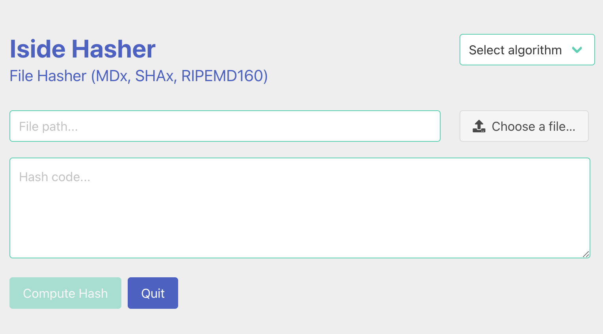

# IsideHasher

The easy file hasher.

IsideHasher is a desktop application built with [Electron](https://www.electronjs.org/).
It computes the hash code of any file (or of a piece of text) using:

* MD4
* MD5
* RIPEMD160
* SHA-1
* SHA-224
* SHA-256
* SHA-384
* SHA-512

## Download

Pre-compiled binaries and release details are available [here](https://github.com/guildenstern70/IsideHasher/releases).

To install the Linux version, open a terminal, `cd` into the directory with the snap image and type:

    sudo snap install --dangerous ./iside-hasher_<version>_amd64.snap

## Running locally (from source)

### Prerequisites

* [Node.js](https://nodejs.org/) **22 or later** (the version used for development is pinned in [`.nvmrc`](.nvmrc))
* [Yarn](https://classic.yarnpkg.com/) 1.x (the repository ships a `yarn.lock`)
* [Git](https://git-scm.com/)

If you use [nvm](https://github.com/nvm-sh/nvm), you can select the right Node.js version with:

    nvm install
    nvm use

If Yarn is not installed, you can enable it through Corepack (bundled with Node.js) or install it globally:

    corepack enable
    # or
    npm install -g yarn

### Setup

Clone the repository and install the dependencies:

    git clone https://github.com/guildenstern70/IsideHasher.git
    cd IsideHasher
    yarn install

`yarn install` also downloads the Electron binary for your platform.

### Run

Start the application with:

    yarn start

Then:

1. Choose **File Mode** or **Text Mode**.
2. Select a hashing algorithm.
3. Pick a file (or type some text) and click the hash button.

## Building distribution packages

This app uses [Electron Builder](https://github.com/electron-userland/electron-builder) to build distribution packages.

| Command     | Result                                                              |
|-------------|---------------------------------------------------------------------|
| `yarn pack` | Builds an unpacked app in `dist/` (useful for quick testing)        |
| `yarn dist` | Builds installable packages for the current platform in `dist/`     |

For detailed instructions on packaging images for macOS, Windows, and Linux, and uploading them as GitHub Releases, see [DEPLOY.md](DEPLOY.md).

## Troubleshooting

* **`Electron failed to install correctly` / missing Electron binary** – the Electron postinstall
  download may have been skipped or interrupted. Run it manually:

      node node_modules/electron/install.js

* **Security warning about Content-Security-Policy in the console** – this warning is shown only
  in development and does not appear once the app is packaged.

## Project structure

| File          | Purpose                                                                   |
|---------------|---------------------------------------------------------------------------|
| `main.js`     | Electron main process: creates the window and computes hashes via `crypto` |
| `preload.js`  | Exposes a minimal, safe API (`window.electron`) to the renderer            |
| `renderer.js` | UI logic for the main window                                               |
| `index.html`  | Main window markup                                                         |
| `css/`        | Stylesheets                                                                |
| `icons/`      | Application icons and screenshot                                           |
| `vendor/`     | Bundled third-party assets (Bulma 0.9.3, Font Awesome Free 5.15.4 solid)   |

The app does not load anything from CDNs or the network: all stylesheets and fonts are
bundled locally under `vendor/`.

## License

Released under the [ISC](LICENSE) license.

Bundled third-party assets keep their own licenses: [Bulma](vendor/bulma/LICENSE) (MIT) and
[Font Awesome Free](vendor/fontawesome/LICENSE.txt) (icons CC BY 4.0, fonts SIL OFL 1.1, code MIT).
